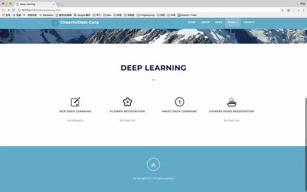

# 基于改进核CNN的离线孤立手写汉字识别
Offline Isolated Handwriting Chinese Charater Regonization

  针对孤立手写汉字的离线识别问题，借鉴GoogleNet的思想，利用深度学习开源框架Tensorflow搭建了一种广度与深度相平衡的卷积神经网络模型，使用改进的横特征、竖特征矩形卷积核，
  并给出其网络拓扑结构，
  通过随机旋转、随机裁剪、随机添加高斯噪声对HCL2000样本集进行扩展，在增加样本量的同时提高了模型
  的泛化能力，对产生仿射形变、弹性形变等的手写汉字样本有较好识别效果。在测试集数据
  的测试中，可达到97%以上的正确率，从而验证了文中识别方法的有效性。最后利用Django搭建了孤立手写汉字识别的Web应用，使模型得以投入实际应用。

## Demo

## Requirement
Package|Version
---|---
TFlearn|0.3.2
Tensorflow|1.8.0
Anaconda3|1.8.4

## Future
Keras version of implementation will soon be updated.
Weights will be shared.